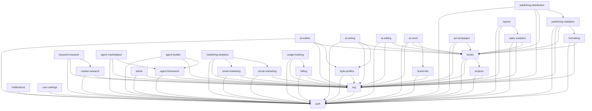

# SelfPublisherForge -- Architecture Overview

## System Architecture

SelfPublisherForge is a modular, AI-powered self-publishing platform built with:

- **Backend**: FastAPI (Python 3.11+), SQLAlchemy 2.0 async, Celery workers
- **Frontend**: Next.js 14 (React 18), TanStack React Query, Zustand, Tailwind CSS
- **Database**: PostgreSQL (primary), Redis (cache, rate limiting, pub/sub)
- **Search**: Elasticsearch 8.x
- **AI**: Anthropic Claude, OpenAI GPT, LangChain orchestration
- **Storage**: AWS S3
- **Payments**: Stripe
- **Email**: SendGrid

---

## Module Dependency Map

The platform is composed of **29 modules**, each with clear ownership, a dedicated API prefix, and explicit dependencies.

```
Module #   Slug                      Tier         API Prefix
--------   ----                      ----         ----------
 1         auth                      free         /auth
 2         org                       free         /orgs
 3         projects                  free         /projects
 4         books                     free         /books
 5         market-research           starter      /market-research
 6         keyword-research          starter      /keywords
 7         style-profiles            free         /style-profiles
 8         brand-kits                starter      /brand-kits
 9         ai-outline                starter      /ai/outlines
10         ai-writing                pro          /ai/writing
11         ai-editing                pro          /ai/editing
12         ai-cover                  pro          /ai/covers
13         formatting                starter      /formatting
14         publishing-validation     starter      /publishing/validation
15         publishing-distribution   pro          /publishing/distribution
16         email-marketing           pro          /marketing/email
17         social-marketing          pro          /marketing/social
18         ad-campaigns              business     /marketing/ads
19         agent-framework           pro          /agents
20         agent-marketplace         pro          /agents/marketplace
21         agent-builder             business     /agents/builder
22         sales-analytics           starter      /analytics/sales
23         marketing-analytics       pro          /analytics/marketing
24         reports                   pro          /reports
25         notifications             free         /notifications
26         user-settings             free         /settings
27         admin                     enterprise   /admin
28         billing                   free         /billing
29         usage-tracking            free         /usage
```

---

## Tier Diagram

Modules are gated by subscription tier. Higher tiers include all lower-tier modules.

```
+---------------------------------------------------------------+
|                        ENTERPRISE                             |
|   admin                                                       |
+---------------------------------------------------------------+
|                         BUSINESS                              |
|   ad-campaigns, agent-builder                                 |
+---------------------------------------------------------------+
|                           PRO                                 |
|   ai-writing, ai-editing, ai-cover, publishing-distribution, |
|   email-marketing, social-marketing, agent-framework,         |
|   agent-marketplace, marketing-analytics, reports             |
+---------------------------------------------------------------+
|                         STARTER                               |
|   market-research, keyword-research, brand-kits, ai-outline, |
|   formatting, publishing-validation, sales-analytics          |
+---------------------------------------------------------------+
|                           FREE                                |
|   auth, org, projects, books, style-profiles, notifications,  |
|   user-settings, billing, usage-tracking                      |
+---------------------------------------------------------------+
```

---

## Dependency Graph



---

## Communication Patterns

### Synchronous (Request/Response)

- **REST API**: All module APIs are served under `/api/v1/{prefix}` via FastAPI.
- **Internal calls**: Modules may import each other's service layer directly within the same process.

### Asynchronous (Event-Driven)

- **Redis Streams**: Used for inter-module events (defined in `shared/types/events.py`).
  - `EventType` enumerates all published events (user.registered, book.created, ai.generation.completed, etc.).
  - Modules publish via `EventPublisher` and subscribe to relevant streams.
- **Celery + Redis**: Background task execution for long-running operations (AI generation, report building, platform syncing).

### Real-Time (WebSocket)

- **WebSocket endpoint**: `/ws` with typed JSON messages.
- **Use cases**: Agent task progress, AI generation streaming, live notification delivery.
- **Client**: `frontend/src/lib/websocket.ts` provides auto-reconnect with exponential backoff.

---

## Data Flow

```
User --> Next.js Frontend --> FastAPI REST API --> PostgreSQL
                  |                   |
                  |                   +--> Redis (cache / rate limit)
                  |                   |
                  |                   +--> Celery Workers --> S3 / Stripe / AI APIs
                  |                   |
                  +-- WebSocket <-----+--> Redis Streams (events)
                                      |
                                      +--> Elasticsearch (search)
```

---

## Project Structure

```
selfpublisherforge/
  backend/
    app/
      api/              # Route handlers (one sub-package per module)
      core/             # Shared infra: security, middleware, logging, rate limiting
      models/           # SQLAlchemy ORM models
      modules/          # Business logic services (one sub-package per module)
      schemas/          # Pydantic request/response schemas
      services/         # Cross-cutting services (email, storage, AI)
      tasks/            # Celery task definitions
    migrations/         # Alembic database migrations
    tests/              # Pytest test suite
  frontend/
    src/
      app/              # Next.js app directory (pages, layouts)
      components/       # Reusable UI components
      hooks/            # Custom React hooks (use-api, etc.)
      lib/              # Utilities (api client, websocket, helpers)
      types/            # TypeScript type definitions
  shared/
    contracts/          # API contracts, module registry
    types/              # Shared enums, event types
  docs/                 # Architecture and feature documentation
  infra/                # Docker, CI/CD, deployment configs
```

---

## Key Design Decisions

| Decision | Choice | Rationale |
|----------|--------|-----------|
| API framework | FastAPI | Async-native, automatic OpenAPI docs, Pydantic validation |
| ORM | SQLAlchemy 2.0 async | Mature, type-safe with mapped_column, async session support |
| Frontend framework | Next.js 14 (App Router) | SSR/SSG, file-based routing, React Server Components |
| State management | Zustand + React Query | Zustand for client state, React Query for server state |
| Task queue | Celery + Redis | Battle-tested, rich ecosystem, Redis already in stack |
| Rate limiting | Redis sliding window | Accurate, distributed, low latency |
| Auth | JWT (access + refresh) | Stateless, scales horizontally, short-lived access tokens |
| Multi-tenancy | Row-level (org_id) | Simple, no schema-per-tenant overhead, enforced at ORM level |
