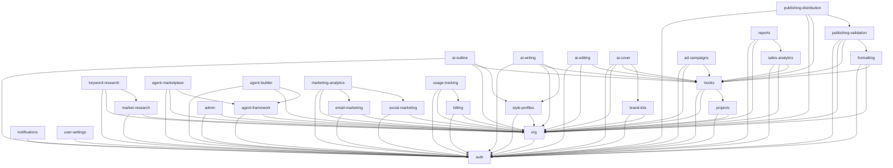

# SelfPublisherForge -- Architecture Overview

## System Architecture

SelfPublisherForge is a modular, AI-powered self-publishing platform built with:

- **Backend**: FastAPI (Python 3.12+), SQLAlchemy 2.0 async, Celery workers
- **Frontend**: Next.js 14 (React 18), TanStack React Query, Zustand, Tailwind CSS, shadcn/ui
- **Database**: PostgreSQL 16 (primary), Redis 7 (cache, rate limiting, pub/sub, task broker)
- **Search**: Elasticsearch 8.x / OpenSearch
- **AI**: Anthropic Claude (primary), OpenAI GPT (fallback), multi-provider LLM orchestration
- **Storage**: AWS S3 / Cloudflare R2
- **Payments**: Stripe (subscriptions, invoices, webhooks)
- **Email**: SendGrid
- **Infrastructure**: Docker, AWS (ECS Fargate, RDS, ElastiCache, S3, ALB, CloudFront), Terraform
- **CI/CD**: GitHub Actions (CI, staging deploy, production blue-green deploy)
- **Monitoring**: Prometheus, Datadog, Grafana, CloudWatch
- **Chrome Extension**: Manifest V3 extension for Amazon marketplace research

---

## Module Dependency Map

The platform is composed of **29 modules**, each with clear ownership, a dedicated API prefix, and explicit dependencies.

```
Module #   Slug                      Tier         API Prefix
--------   ----                      ----         ----------
 1         auth                      free         /auth
 2         org                       free         /orgs
 3         projects                  free         /projects
 4         books                     free         /books
 5         market-research           starter      /market-research
 6         keyword-research          starter      /keywords
 7         style-profiles            free         /style-profiles
 8         brand-kits                starter      /brand-kits
 9         ai-outline                starter      /ai/outlines
10         ai-writing                pro          /ai/writing
11         ai-editing                pro          /ai/editing
12         ai-cover                  pro          /ai/covers
13         formatting                starter      /formatting
14         publishing-validation     starter      /publishing/validation
15         publishing-distribution   pro          /publishing/distribution
16         email-marketing           pro          /marketing/email
17         social-marketing          pro          /marketing/social
18         ad-campaigns              business     /marketing/ads
19         agent-framework           pro          /agents
20         agent-marketplace         pro          /agents/marketplace
21         agent-builder             business     /agents/builder
22         sales-analytics           starter      /analytics/sales
23         marketing-analytics       pro          /analytics/marketing
24         reports                   pro          /reports
25         notifications             free         /notifications
26         user-settings             free         /settings
27         admin                     enterprise   /admin
28         billing                   free         /billing
29         usage-tracking            free         /usage
```

---

## Tier Diagram

Modules are gated by subscription tier. Higher tiers include all lower-tier modules.

```
+---------------------------------------------------------------+
|                        ENTERPRISE                             |
|   admin                                                       |
+---------------------------------------------------------------+
|                         BUSINESS                              |
|   ad-campaigns, agent-builder                                 |
+---------------------------------------------------------------+
|                           PRO                                 |
|   ai-writing, ai-editing, ai-cover, publishing-distribution, |
|   email-marketing, social-marketing, agent-framework,         |
|   agent-marketplace, marketing-analytics, reports             |
+---------------------------------------------------------------+
|                         STARTER                               |
|   market-research, keyword-research, brand-kits, ai-outline, |
|   formatting, publishing-validation, sales-analytics          |
+---------------------------------------------------------------+
|                           FREE                                |
|   auth, org, projects, books, style-profiles, notifications,  |
|   user-settings, billing, usage-tracking                      |
+---------------------------------------------------------------+
```

---

## Dependency Graph



---

## Communication Patterns

### Synchronous (Request/Response)

- **REST API**: All module APIs are served under `/api/v1/{prefix}` via FastAPI.
- **Internal calls**: Modules may import each other's service layer directly within the same process.

### Asynchronous (Event-Driven)

- **Redis Streams**: Used for inter-module events (defined in `shared/types/events.py`).
  - `EventType` enumerates all published events (user.registered, book.created, ai.generation.completed, etc.).
  - Modules publish via `EventPublisher` and subscribe to relevant streams.
- **Celery + Redis**: Background task execution for long-running operations (AI generation, report building, platform syncing).

### Real-Time (WebSocket)

- **WebSocket endpoint**: `/ws` with typed JSON messages.
- **Use cases**: Agent task progress, AI generation streaming, live notification delivery.
- **Client**: `frontend/src/lib/websocket.ts` provides auto-reconnect with exponential backoff.

---

## Data Flow

```
User --> Next.js Frontend --> FastAPI REST API --> PostgreSQL
                  |                   |
                  |                   +--> Redis (cache / rate limit)
                  |                   |
                  |                   +--> Celery Workers --> S3 / Stripe / AI APIs
                  |                   |
                  +-- WebSocket <-----+--> Redis Streams (events)
                                      |
                                      +--> Elasticsearch (search)
```

---

## Project Structure

```
selfpublisherforge/
  backend/
    app/
      api/              # Route handlers (one sub-package per module)
      core/             # Shared infra: security, middleware, logging, rate limiting
      models/           # SQLAlchemy ORM models
      modules/          # Business logic services (one sub-package per module)
      schemas/          # Pydantic request/response schemas
      services/         # Cross-cutting services (email, storage, AI)
      tasks/            # Celery task definitions
    migrations/         # Alembic database migrations
    tests/              # Pytest test suite
  frontend/
    src/
      app/              # Next.js app directory (pages, layouts)
      components/       # Reusable UI components
      hooks/            # Custom React hooks (use-api, etc.)
      lib/              # Utilities (api client, websocket, helpers)
      modules/          # 19 frontend feature modules
        admin/              # Admin panel (Enterprise)
        analytics/          # Analytics dashboards
        competitor-finder/  # Competitor research and gap analysis
        cover-design/       # Cover Design Studio
        kdp-validation/     # KDP validation dashboard
        notifications/      # Notification Center
        portfolio-economics/ # Portfolio Economics dashboard
        pricing/            # Pricing Automation tools
        review-intelligence/ # Review Intelligence dashboard
        style-profiles/     # Style Profile manager
      types/            # TypeScript type definitions
  shared/
    contracts/          # API contracts, module registry
    types/              # Shared enums, event types
  docs/                 # Architecture and feature documentation
  infra/                # Docker, CI/CD, deployment configs
```

---

## Key Design Decisions

| Decision | Choice | Rationale |
|----------|--------|-----------|
| API framework | FastAPI | Async-native, automatic OpenAPI docs, Pydantic validation |
| ORM | SQLAlchemy 2.0 async | Mature, type-safe with mapped_column, async session support |
| Frontend framework | Next.js 14 (App Router) | SSR/SSG, file-based routing, React Server Components |
| State management | Zustand + React Query | Zustand for client state, React Query for server state |
| Task queue | Celery + Redis | Battle-tested, rich ecosystem, Redis already in stack |
| Rate limiting | Redis sliding window | Accurate, distributed, low latency |
| Auth | JWT (access + refresh) + OAuth | Stateless JWT for API, OAuth for social login (Google, GitHub), short-lived access tokens |
| Multi-tenancy | Row-level (org_id) | Simple, no schema-per-tenant overhead, enforced at ORM level |
| AI provider strategy | Anthropic Claude (primary) + OpenAI (fallback) | Best-in-class quality, failover resilience, cost tracking per request |
| Event system | Redis Streams | Lightweight, no extra infrastructure, supports consumer groups |
| Real-time updates | WebSocket + Redis pub/sub | Live notifications, agent progress, connection pooling |
| Search engine | Elasticsearch 8.x | Mature full-text search, used primarily by Knowledge Vault |
| i18n | Next-intl | Type-safe translations, SSR support, locale routing |
| Accessibility | WCAG 2.1 AA | Keyboard navigation, screen readers, ARIA labels, focus management |
| Rate limiting | Redis sliding window + tier multipliers | Accurate, distributed, tier-based limits (Free: 1x, Pro: 5x, etc.) |
| IaC | Terraform | Declarative, multi-environment support, state locking via DynamoDB |
| Deployment | ECS Fargate + CodeDeploy | Serverless containers, blue-green deploys, auto-rollback |
| Monitoring | Prometheus + Datadog | Open-source metrics collection with enterprise APM overlay |

---

## Infrastructure Architecture

### AWS Production Environment

```
Internet
  |
  v
CloudFront (CDN)
  |
  v
Application Load Balancer
  |
  +---> ECS Fargate: API Service (2-10 instances, auto-scaled)
  |       |
  |       +---> RDS PostgreSQL 16 (multi-AZ)
  |       +---> ElastiCache Redis 7
  |       +---> OpenSearch (Elasticsearch-compatible)
  |       +---> S3 (asset storage)
  |       +---> External APIs (Anthropic, OpenAI, Stripe, SendGrid, Amazon)
  |
  +---> ECS Fargate: Frontend Service (Next.js SSR)
  |
  +---> ECS Fargate: Celery Worker (2 instances)
  |
  +---> ECS Fargate: Celery Beat (1 instance, scheduler)
```

### Local Development Environment (Docker Compose)

12 services running in a single Docker network:

| Service | Image | Port | Purpose |
|---|---|---|---|
| backend | Custom (FastAPI) | 8000 | API server with hot reload |
| frontend | Custom (Next.js) | 3000 | Frontend dev server |
| postgres | postgres:16-alpine | 5432 | Primary database |
| redis | redis:7-alpine | 6379 | Cache, broker, pub/sub |
| elasticsearch | elasticsearch:8.15.0 | 9200 | Full-text search |
| celery-worker | Custom (backend) | -- | Background task processing |
| celery-beat | Custom (backend) | -- | Scheduled task triggers |
| flower | Custom (backend) | 5555 | Celery monitoring UI |
| prometheus | prom/prometheus | 9090 | Metrics aggregation |
| postgres-exporter | prometheuscommunity/postgres-exporter | 9187 | PostgreSQL metrics |
| redis-exporter | oliver006/redis_exporter | 9121 | Redis metrics |
| node-exporter | prom/node-exporter | 9100 | System metrics |

---

## Celery Task Modules

Background tasks are organized by feature domain in `backend/app/tasks/`:

| Task Module | Responsibilities |
|---|---|
| `advertising.py` | Ad campaign sync, bid optimization, creative generation |
| `agent_system.py` | Agent task execution, governance checks, audit logging |
| `analytics.py` | Revenue aggregation, royalty import, report generation |
| `competitor_finder.py` | Competitive analysis, review scraping, gap detection |
| `knowledge_vault.py` | Document import, AI extraction, search indexing |
| `market_intelligence.py` | BSR tracking, niche analysis, trend computation |
| `marketing.py` | Email sequence dispatch, ARC management, social posting |
| `notifications.py` | Email delivery, in-app notification dispatch |
| `portfolio_economics.py` | Backlist analysis, audience profiling, seasonal scoring |
| `pricing_automation.py` | Price strategy execution, KU calculations, simulation |
| `production_pipeline.py` | EPUB/PDF generation, format conversion |
| `publishing_ops.py` | Platform sync, listing updates, distribution |
| `review_intelligence.py` | Sentiment analysis, velocity tracking, alert evaluation |
| `style_cloning.py` | Voice fingerprint extraction, style profile generation |
| `dead_letter.py` | Failed task retry, dead letter queue management |
| `scheduler.py` | Beat schedule configuration for recurring tasks |

---

## Chrome Extension Architecture

The Chrome extension (`extension/`) is a Manifest V3 extension for Amazon marketplace research:

```
extension/
  background/          # Service worker for API communication and state management
  content/             # Content scripts injected into Amazon product pages
    amazon-extractor.js  # Extracts ASIN, BSR, pricing, reviews, category data
  popup/               # Extension popup for quick actions
  sidebar/             # Side panel for detailed research view
  icons/               # Extension icons (16, 48, 128px)
  styles/              # Shared CSS
  manifest.json        # Extension configuration
```

**Supported Marketplaces**: amazon.com, amazon.co.uk, amazon.de, amazon.fr, amazon.ca, amazon.com.au, amazon.co.jp, amazon.it, amazon.es, amazon.in

**Capabilities**: Product data extraction, BSR tracking, niche research, clip saving to SelfPublisherForge account via API.

---

## Frontend Module Architecture

The frontend is organized into 19 feature modules, each following a standardized structure:

```
modules/<module-name>/
  components/       # Module-specific React components
  hooks.ts          # React Query hooks and custom hooks
  types.ts          # TypeScript type definitions
  utils.ts          # Utility functions
```

### Frontend Modules (v1.1.0)

| Module | Route | Tier | Description |
|---|---|---|---|
| **admin** | `/admin` | Enterprise | User management, org management, billing oversight, system health |
| **analytics** | `/analytics` | Starter | Revenue dashboards, sales tracking, custom reports |
| **competitor-finder** | `/competitor-finder` | Pro | Gap analysis, opportunity detection, competitor research |
| **cover-design** | `/cover-studio` | Pro | AI cover generation, template library, design editor |
| **kdp-validation** | `/kdp-validation` | Starter | Pre-flight compliance checks, validation reports |
| **notifications** | `/notifications` | Free | Real-time notification center, preferences |
| **portfolio-economics** | `/portfolio-economics` | Pro | Backlist analysis, greenlight scoring, opportunity detection |
| **pricing** | `/pricing` | Pro | Dynamic pricing, KU calculator, price simulator |
| **review-intelligence** | `/review-intelligence` | Pro | Sentiment analysis, review velocity, alerts |
| **style-profiles** | `/style-profiles` | Free | Voice fingerprinting, conformity checking |

### Frontend Architecture Patterns

**State Management**:
- **Zustand** for client-side state (UI state, user preferences)
- **TanStack React Query** for server state (API data, caching, mutations)
- **WebSocket Context** for real-time updates

**Data Fetching**:
- Centralized API client in `lib/api.ts`
- React Query hooks pattern: `useModuleData()`, `useModuleMutation()`
- Optimistic updates for mutations
- Automatic retry with exponential backoff

**Real-Time Updates**:
- Shared WebSocket connection (`lib/websocket.ts`)
- Type-safe event handlers
- Auto-reconnect with exponential backoff
- Connection pooling across components

**Styling & UI**:
- Tailwind CSS utility classes
- shadcn/ui component library
- Consistent design tokens
- Dark mode support (planned)

**Internationalization**:
- next-intl for translations
- Supported locales: en, es, de
- Type-safe translation keys
- SSR-compatible locale routing

**Accessibility**:
- WCAG 2.1 AA compliant
- Keyboard navigation throughout
- Screen reader support with ARIA labels
- Focus management in modals and dialogs
- Error announcements for assistive tech

**Performance**:
- Code splitting per module
- Lazy loading with React.lazy()
- Image optimization with next/image
- Bundle size monitoring
- Lighthouse CI integration

---

## Security Architecture

| Layer | Implementation |
|---|---|
| Authentication | JWT access tokens (15 min) + refresh tokens (7 days) + OAuth (Google, GitHub) |
| MFA | TOTP-based multi-factor authentication |
| Authorization | Role-based access control per organization |
| Data isolation | Row-level multi-tenancy via `org_id` on all tenant-scoped models |
| Rate limiting | Redis sliding window per endpoint with tier multipliers (Free: 1x, Pro: 5x, Enterprise: unlimited) |
| Secrets | AWS SSM Parameter Store (production), `.env` files (development) |
| API security | CORS whitelist, CSP headers, request validation via Pydantic, structured error responses |
| Dependency scanning | pip-audit (backend), npm audit (frontend) in CI pipeline |
| Input validation | Pydantic schemas on all API endpoints |
| OAuth security | PKCE flow, state validation, token refresh |
| Webhook security | Stripe signature verification, idempotency handling |

---

## Testing Strategy

### Backend (2,183+ tests passing)

| Test Type | Location | Scope |
|---|---|---|
| Unit tests | `tests/unit/` | Individual service methods, utility functions |
| Module tests | `tests/test_*.py` | Per-module tests (agent system, analytics, tasks, etc.) |
| Integration tests | `tests/integration/` | Cross-module interactions, database queries |
| E2E tests | `tests/e2e/` | Full API request/response flows |
| Smoke tests | `tests/test_smoke.py` | Basic health and import validation |

**Test infrastructure**: Pytest with async support, PostgreSQL and Redis service containers in CI, coverage reporting via `pytest-cov`.

### Frontend (300+ tests passing)

| Test Type | Tool | Scope |
|---|---|---|
| Component tests | Jest + React Testing Library | Component rendering, hooks, user interactions |
| Integration tests | Jest | WebSocket connections, API client, state management |
| E2E tests | Playwright | Full user flows against staging |
| Accessibility tests | axe-core | WCAG 2.1 AA compliance |
| Visual regression | Playwright | UI consistency checks |
| Load tests | Locust | Performance and scalability |

---

## CI/CD Pipeline

```
Pull Request
  |
  v
CI Pipeline (ci.yml)
  +---> Backend: ruff lint -> ruff format -> mypy -> pytest (2,183+ tests) -> pip-audit
  +---> Frontend: ESLint -> tsc -> Jest -> npm audit
  +---> Docker: Build validation (API + frontend images)
  +---> Integration: Cross-module tests with PostgreSQL + Redis
  |
  v
Merge to main
  |
  v
Staging Deploy (deploy-staging.yml)
  +---> Build & push images to ECR
  +---> Update ECS task definitions
  +---> Deploy API, frontend, worker, beat services
  +---> Run Playwright E2E tests against staging
  +---> Slack notification
  |
  v
Tag push (v*.*.*)
  |
  v
Production Deploy (deploy-production.yml)
  +---> Build & push versioned images to ECR
  +---> Save current task definitions for rollback
  +---> Blue-green deploy via CodeDeploy
  +---> Health check + error rate monitoring
  +---> Auto-rollback if >1% error rate
  +---> Slack notification
```
